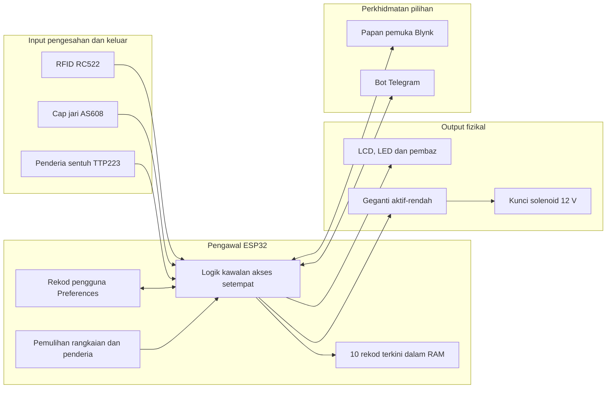
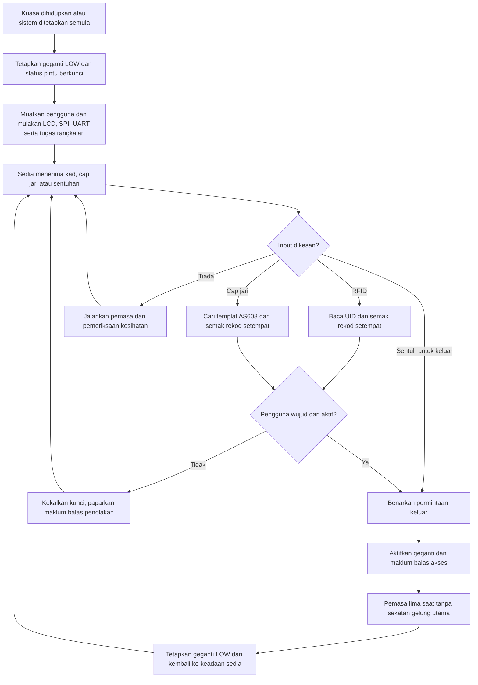
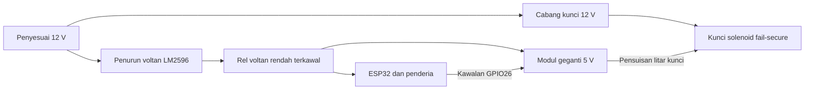
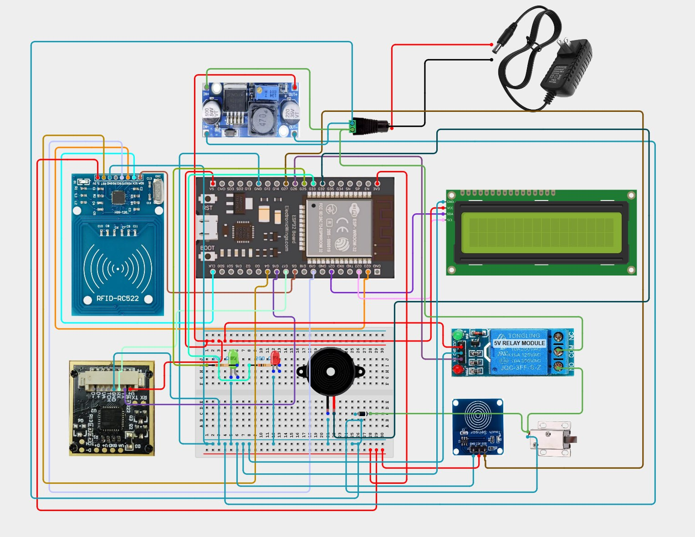

# PTA Smart Door

PTA Smart Door ialah prototaip sistem kawalan akses berasaskan ESP32 DevKit V1. Sistem ini menggabungkan pengesahan RFID dan cap jari, penderia sentuh untuk keluar, rekod pengguna setempat, paparan status, geganti bagi mengawal kunci solenoid, serta perkhidmatan Blynk dan Telegram secara pilihan.

> **Skop projek:** Prototaip berfungsi untuk pembelajaran dan demonstrasi akademik. Sistem ini belum diperakui dan tidak sesuai digunakan sebagai sistem keselamatan bangunan sebenar.

## Ringkasan Sistem

| Aspek | Pelaksanaan semasa |
| --- | --- |
| Pengawal utama | ESP32 DevKit V1 |
| Kaedah masuk | RFID RC522 dan pengesahan cap jari AS608 |
| Kaedah keluar | Penderia sentuh TTP223 |
| Penggerak kunci | Geganti aktif-rendah 5 V yang mengawal kunci solenoid *fail-secure* 12 V |
| Maklum balas setempat | LCD1602 I2C, LED hijau dan merah, serta pembaz aktif |
| Rekod pengguna | Hingga 50 slot pengguna dalam ESP32 Preferences |
| Perkhidmatan rangkaian | Kawalan dan status melalui Blynk; pemantauan melalui Telegram |
| Ketahanan operasi | Pengesahan setempat kekal berfungsi tanpa sambungan awan; logik pemulihan Wi-Fi, RFID dan penderia cap jari disediakan |
| Bukti dalam repositori | Perisian tegar tanpa maklumat pengesahan sulit, simulasi RFID Proteus, matriks ujian UID dan rajah pendawaian |

## Pernyataan Masalah

Kunci mekanikal biasa tidak menunjukkan proses pengesahan identiti elektronik, maklum balas peristiwa atau pemantauan melalui rangkaian. Projek ini mengkaji cara sebuah mikropengawal menyelaras beberapa kaedah pengesahan dan kunci fizikal, sambil mengekalkan fungsi akses setempat apabila perkhidmatan Internet tidak tersedia.

## Objektif Projek

- Menggabungkan input RFID, cap jari dan penderia sentuh pada sebuah ESP32.
- Membuat keputusan kebenaran akses secara setempat pada peranti.
- Memberikan maklum balas yang jelas melalui LCD, LED dan pembaz.
- Membuka kunci solenoid melalui geganti dan menguncinya semula secara automatik.
- Menyediakan fungsi pemantauan dan pengurusan pengguna melalui Blynk dan Telegram secara pilihan.
- Memulihkan operasi selepas gangguan sementara pada rangkaian atau pembaca tanpa memulakan semula ESP32 secara sengaja.
- Mendokumenkan seni bina, batasan dan bukti projek untuk semakan akademik.

## Fungsi Semasa dan Cadangan V2

| Dilaksanakan dalam prototaip semasa | Dicadangkan untuk Smart Door V2 |
| --- | --- |
| Pengesahan RFID dan cap jari | Kunci magnet dan litar pemacu kunci yang disemak semula |
| Penderia sentuh TTP223 untuk keluar | Penderia sentuhan pintu jenis *reed/contact* |
| Rekod pengguna setempat melalui ESP32 Preferences | Pengesanan pintu dibuka secara paksa atau dibiarkan terbuka |
| Maklum balas LCD1602, LED dan pembaz | Antara muka TFT/IPS berwarna |
| Kunci semula automatik selepas lima saat | Cap masa NTP dengan sokongan RTC |
| Status, kawalan kunci dan tindakan pengguna melalui Blynk | Aplikasi mudah alih tersuai dengan kawalan kebenaran |
| Pertanyaan status, pengguna dan log terkini melalui Telegram | Kemas kini OTA dan pemantauan kesihatan peranti |
| Percubaan semula Wi-Fi serta pemulihan pembaca | Pengesanan usikan, amaran dipertingkat dan pautan peristiwa CCTV secara pilihan |
| Paparan 10 rekod akses terkini dalam RAM | Storan audit kekal yang boleh dieksport |

Semua perkara dalam lajur kanan ialah **cadangan masa hadapan** dan belum dilaksanakan.

## Komponen Perkakasan

| Komponen | Fungsi |
| --- | --- |
| ESP32 DevKit V1 | Pengawal utama dan antara muka rangkaian |
| RC522 | Pembaca kad RFID melalui SPI |
| AS608 | Pembaca cap jari melalui UART2 pada 57,600 baud |
| TTP223 | Input sentuh untuk permintaan keluar |
| LCD1602 I2C | Paparan arahan dan status setempat |
| Modul geganti aktif-rendah 5 V | Antara muka elektrik bagi litar kunci |
| Kunci solenoid *fail-secure* 12 V | Penggerak mekanikal kunci |
| LED hijau dan merah | Petunjuk akses dibenarkan atau ditolak |
| Pembaz aktif | Maklum balas bunyi |
| Penurun voltan LM2596 | Membekalkan voltan rendah terkawal kepada elektronik |
| Penyesuai 12 V | Bekalan utama prototaip |

## Seni Bina Sistem



ESP32 membuat keputusan akses secara setempat. Blynk dan Telegram menambah fungsi pengurusan dan pemantauan, tetapi tidak diperlukan untuk operasi RFID, cap jari atau penderia sentuh.

## Aliran Operasi



### Cara Menggunakan Prototaip

1. Periksa mekanisme kunci, sambungan bumi sepunya dan bekalan terkawal sebelum menghidupkan kuasa.
2. Hidupkan sistem. Perisian tegar menetapkan geganti kepada `LOW` semasa permulaan dan memuatkan rekod pengguna daripada ESP32 Preferences.
3. Tunggu sehingga paparan menunjukkan sistem sedia.
4. Sentuhkan kad RFID berdaftar, imbas cap jari berdaftar atau sentuh penderia keluar dari bahagian dalam.
5. Perhatikan LCD, LED dan pembaz. Akses yang dibenarkan mengaktifkan laluan buka kunci selama kira-kira lima saat; akses yang ditolak mengekalkan pintu dalam keadaan berkunci.
6. Jika Blynk dan Telegram telah dikonfigurasi secara peribadi, gunakan fungsi status dan pengurusan yang diterangkan di bawah.

Jangan gunakan prototaip ini sebagai satu-satunya kawalan keselamatan bagi ruang yang digunakan oleh orang ramai.

## Pengesahan dan Kawalan Akses

### Akses RFID

1. RC522 membaca UID kad.
2. UID dibandingkan dengan rekod pengguna setempat.
3. Akses diberikan hanya jika rekod pengguna wujud dan berstatus aktif.
4. Kad yang sama disekat sementara selama 1.2 saat bagi mengelakkan bacaan berulang.
5. Jika pembaca gagal, perisian tegar menjalankan percubaan pemulihan berjadual.

### Akses Cap Jari

1. AS608 menangkap dan menukar imej cap jari.
2. Penderia mencari padanan dalam pustaka templatnya.
3. ID templat dipadankan dengan rekod pengguna setempat.
4. Akses diberikan hanya jika pengguna wujud dan berstatus aktif.
5. Sistem menunggu jari dialihkan sebelum kembali ke keadaan sedia.

### Permintaan Keluar

Input TTP223 menggunakan pengesanan pinggir dengan nyahlantun 300 ms. Sentuhan yang sah menggunakan laluan akses dibenarkan yang sama, dengan identiti `Exit User` dan kaedah `Touch`. Pengesahan RFID atau cap jari tidak diperlukan kerana input ini mewakili permintaan keluar dari bahagian dalam.

### Hasil Akses

| Keadaan | Kunci | Maklum balas | Rekod |
| --- | --- | --- | --- |
| Pengguna RFID aktif | Dibuka, kemudian dikunci semula | Nama dan status pada LCD; LED hijau dan pembaz | Ditambah pada log RAM dan baris gilir perkhidmatan rangkaian |
| Pengguna cap jari aktif | Dibuka, kemudian dikunci semula | Nama dan status pada LCD; LED hijau dan pembaz | Ditambah pada log RAM dan baris gilir perkhidmatan rangkaian |
| Sentuhan keluar | Dibuka, kemudian dikunci semula | Maklum balas keluar | Direkodkan sebagai `Exit User` / `Touch` |
| Kelayakan tidak dikenali atau pengguna disekat | Kekal berkunci | Urutan penolakan pada LCD, LED merah dan pembaz | Percubaan ditolak dimasukkan ke laluan log terkini |

`DOOR_UNLOCK_TIME` ditetapkan kepada 5,000 ms. Fungsi `updateDoor()` menyemak masa berlalu tanpa menghentikan gelung kawalan utama, kemudian menetapkan geganti aktif-rendah kepada `LOW` dan mengembalikan sistem ke keadaan sedia.

## Perkhidmatan IoT

Gelung perkakasan dipisahkan daripada tugas rangkaian. Baris gilir FreeRTOS memindahkan arahan perkakasan dan peristiwa status antara logik setempat dengan tugas Blynk dan Telegram.

### Blynk

Perisian tegar menyediakan pengendali untuk:

- arahan buka dan kunci secara manual;
- pemilihan slot pengguna dan paparan status;
- penambahan pengguna, pendaftaran RFID atau cap jari, sekatan, nyahsekat dan pemadaman;
- pembatalan proses pendaftaran yang sedang berjalan;
- pemilihan rangkaian Wi-Fi secara automatik atau manual; dan
- paparan keadaan pintu, bilangan akses, status sistem serta log terkini.

Konfigurasi widget atau aliran data Blynk tidak disertakan. Oleh itu, papan pemuka tidak boleh dibina semula menggunakan perisian tegar sahaja.

### Telegram

Bot menyemak ID sembang yang dikonfigurasi sebelum melayani arahan `/users`, `/logs` dan `/status`. Bot turut menerima pemberitahuan akses dan pengurusan pengguna melalui baris gilir.

Perisian tegar semasa menggunakan `telegramClient.setInsecure()`, yang melumpuhkan pengesahan sijil TLS. Kekangan ini perlu diperbetulkan sebelum sebarang penggunaan yang melibatkan keselamatan sebenar.

### Operasi Luar Talian

Gelung utama tidak bergantung pada Blynk atau Telegram untuk mengesahkan kelayakan setempat. Tugas latar mencuba rangkaian Wi-Fi yang dikonfigurasi secara bergilir selepas tamat masa 10 saat. Pemberitahuan awan dan arahan jarak jauh tidak tersedia semasa sambungan terputus.

## Pengurusan Pengguna dan Log

Setiap rekod pengguna mengandungi nama, UID RFID, ID templat cap jari, status aktif dan penanda kewujudan. Metadata disimpan dalam ESP32 Preferences, manakala templat biometrik kekal dalam penderia AS608.

Sistem menyimpan 10 peristiwa terkini dalam RAM untuk dipaparkan melalui Blynk atau Telegram. Log ini hilang selepas ESP32 dimulakan semula, bukan jejak audit bebas dan memerlukan masa rangkaian untuk cap masa yang bermakna.

## Pemetaan Pin ESP32

| Modul | Sambungan ESP32 |
| --- | --- |
| LCD1602 I2C | SDA GPIO21; SCL GPIO22; alamat `0x27` |
| RC522 RFID | SS/SDA GPIO5; RST GPIO2; SCK GPIO18; MOSI GPIO23; MISO GPIO19 |
| AS608 | TX penderia ke RX GPIO16; RX penderia ke TX GPIO17; `HardwareSerial(2)` pada 57,600 baud |
| TTP223 | GPIO27 |
| Geganti aktif-rendah | GPIO26 |
| LED hijau | GPIO25 |
| LED merah | GPIO33 |
| Pembaz aktif | GPIO32 |

## Seni Bina Kuasa



Rajah ini menerangkan tujuan bekalan kuasa pada peringkat komponen. Repositori belum menyediakan belanjawan kuasa terukur atau skema kuasa lengkap dari terminal ke terminal. Sebelum pemasangan semula, sahkan voltan keluaran LM2596, kadar sentuhan geganti, arus solenoid, perlindungan aruhan balik, saiz konduktor, rujukan bumi sepunya dan pengasingan yang selamat.

## Seni Bina dan Kebolehpercayaan Perisian Tegar

- **Gelung berkeutamaan perkakasan:** Mengendalikan tamat masa pendaftaran, arahan berbaris gilir, pemasa kunci/pembaz/LCD, kesihatan pembaca, pengesahan dan input sentuh.
- **Penyimpanan setempat:** `Preferences` menyimpan hingga 50 rekod pengguna.
- **Mesin keadaan:** Proses RFID, permulaan dan pengesahan cap jari serta pendaftaran mengurangkan operasi yang menyekat gelung biasa.
- **Keserentakan:** Baris gilir FreeRTOS dan mutex menyelaras keadaan setempat dengan tugas Blynk dan Telegram.
- **Pemulihan:** RC522 dimulakan semula mengikut jadual dan UART2 AS608 disegerakkan semula tanpa memulakan semula ESP32 secara sengaja.
- **Keadaan permulaan selamat:** Geganti ditetapkan kepada `LOW` dan `doorUnlocked` kepada `false` semasa `setup()`.

Kod sumber mengesahkan kewujudan mekanisme di atas, tetapi repositori belum mengandungi keputusan ujian gangguan kuasa terkawal, masa pemulihan terukur, ujian operasi jangka panjang atau pengesahan keadaan fizikal kunci bagi setiap kegagalan bekalan.

## Bukti Pengujian

| Bukti | Perkara yang disokong | Batasan bukti |
| --- | --- | --- |
| [Perisian tegar](firmware/FULL_CODE_SmartDoor_PTA1.ino) | Laluan kawalan, pemasaan, pin, penyimpanan dan logik pemulihan | Semakan kod tidak membuktikan semua laluan telah diuji secara fizikal |
| [Projek Proteus](docs/Litar%20simulasi%20Smart%20Door.pdsprj) | Simulasi berorientasikan RFID yang boleh diulangi | Tidak memodelkan keseluruhan sistem ESP32, AS608 dan awan |
| [Panduan simulasi](docs/PROTEUS_SIMULATION_GUIDE.md) | Prosedur demonstrasi yang boleh diulangi | Keputusan sebenar perlu direkodkan oleh penilai |
| [Matriks ujian UID](docs/PROTEUS_UID_TESTS.md) | Dua kes RFID dibenarkan dan satu kes ditolak | Kes simulasi, bukan ukuran prestasi keselamatan |
| [Rajah pendawaian](docs/Smart-Door-Cirkit-Designer-Wiring.png) | Rujukan sambungan komponen | Bukan lukisan elektrik diperakui atau pemeriksaan pemasangan sebenar |

Lihat [Pengujian dan Bukti](docs/TESTING_AND_EVIDENCE.md) untuk matriks pengesahan dan perkara yang belum disahkan.



*Rajah 1. Rujukan pendawaian sedia ada daripada Cirkit Designer. Gambar peribadi dan tangkap layar papan pemuka tidak disertakan.*

## Pertimbangan Keselamatan

- Perisian tegar awam menggunakan ruang letak bagi maklumat pengesahan Wi-Fi, Blynk dan Telegram.
- Padanan UID RFID boleh ditiru dan bukan kaedah pengesahan berjaminan tinggi.
- Buka kunci jarak jauh bergantung pada keselamatan akaun, token dan ID sembang yang digunakan.
- Sistem belum mempunyai penderia kedudukan pintu, pembukaan paksa atau usikan bekas.
- Log dalam RAM tidak kalis usikan dan bukan jejak audit kekal.
- Pengesahan sijil TLS Telegram dilumpuhkan dalam versi semasa.
- Susunan *fail-secure*, laluan keluar kecemasan, kebakaran dan keperluan elektrik setempat perlu dinilai sebelum pemasangan sebenar.

Lihat [SECURITY.md](SECURITY.md) untuk panduan pengurusan maklumat sulit dan kebersihan repositori.

## Batasan Semasa

- Belum diperakui dan belum menjalani penilaian ancaman atau pematuhan.
- Tiada penderia kedudukan pintu; perisian tidak dapat mengesahkan bahawa pintu benar-benar tertutup.
- Tiada pengesanan pembukaan paksa, pintu dibiarkan terbuka atau usikan bekas.
- Log akses terhad kepada 10 entri RAM dan hilang selepas mula semula.
- Konfigurasi papan pemuka awan tidak disertakan untuk penghasilan semula satu langkah.
- Cap masa rangkaian tiada sandaran RTC.
- Tiada belanjawan kuasa, perlindungan bateri/UPS atau rekod ujian kegagalan kuasa terkawal.
- Bukti Proteus hanya meliputi demonstrasi RFID, bukan sistem fizikal bersepadu sepenuhnya.
- Tiada video demonstrasi atau foto prototaip fizikal yang telah disemak dari sudut privasi.

## Cadangan Smart Door V2

Cadangan penambahbaikan merangkumi penderia kedudukan pintu, pengesanan pembukaan paksa dan usikan, antara muka TFT/IPS, cap masa NTP dengan RTC, storan audit kekal, aplikasi mudah alih dengan kawalan peranan, kemas kini OTA bertandatangan dan pilihan pengesahan berbilang faktor. Cadangan ini belum dilaksanakan dalam prototaip semasa.

## Struktur Repositori

```text
PTA-Smart-Door/
|-- README.md
|-- SECURITY.md
|-- firmware/
|   `-- FULL_CODE_SmartDoor_PTA1.ino
`-- docs/
    |-- Litar simulasi Smart Door.pdsprj
    |-- PROTEUS_SIMULATION_GUIDE.md
    |-- PROTEUS_UID_TESTS.md
    |-- Smart-Door-Cirkit-Designer-Wiring.png
    `-- TESTING_AND_EVIDENCE.md
```

## Sumber Projek

- [Perisian tegar Arduino](firmware/FULL_CODE_SmartDoor_PTA1.ino) — menggunakan ruang letak bagi maklumat pengesahan sulit.
- [Panduan simulasi Proteus](docs/PROTEUS_SIMULATION_GUIDE.md)
- [Kes ujian UID RFID](docs/PROTEUS_UID_TESTS.md)
- [Projek Cirkit Designer](https://app.cirkitdesigner.com/project/c76d481d-00aa-41fe-8f70-778ca7574145)

## Hasil Pembelajaran Praktikal

Projek ini menunjukkan pendedahan praktikal kepada input/output terbenam, peranti SPI/I2C/UART, logik kawalan akses berbilang kaedah, rekod tidak meruap, mesin keadaan, penyelarasan tugas FreeRTOS, integrasi IoT, pemulihan ralat dan dokumentasi kejuruteraan. Pernyataan ini menerangkan skop pembelajaran prototaip, bukan tuntutan kepakaran keselamatan bertaraf pengeluaran.
