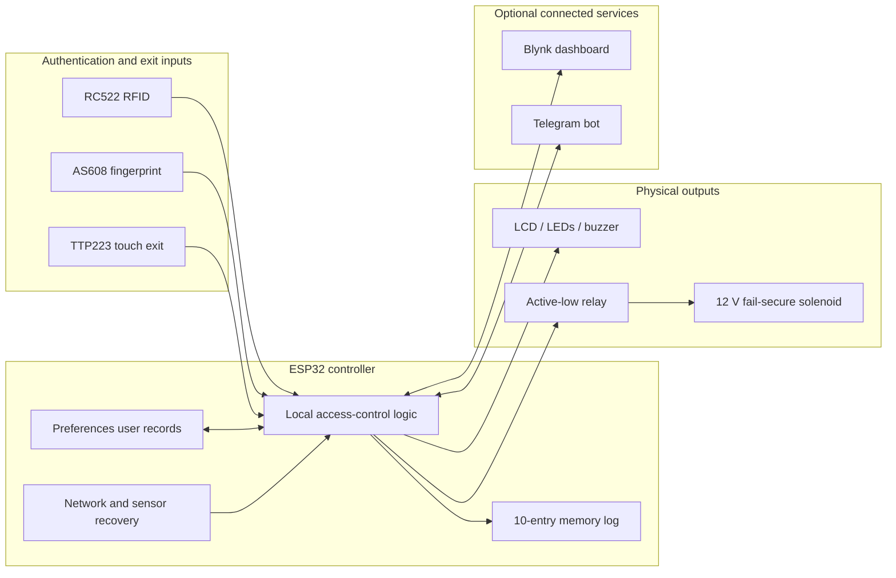
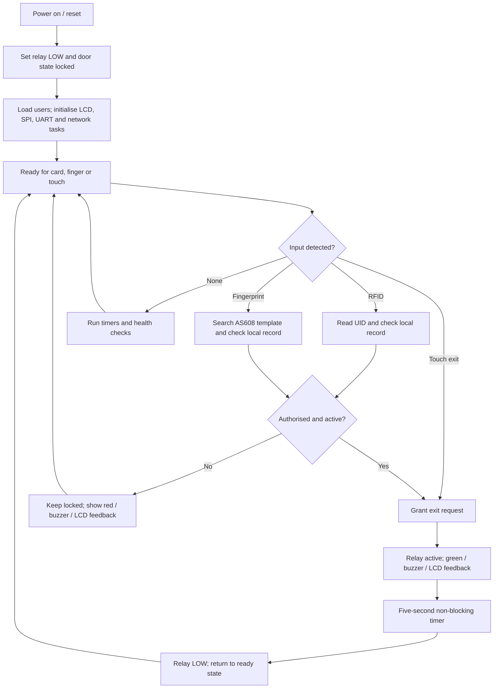
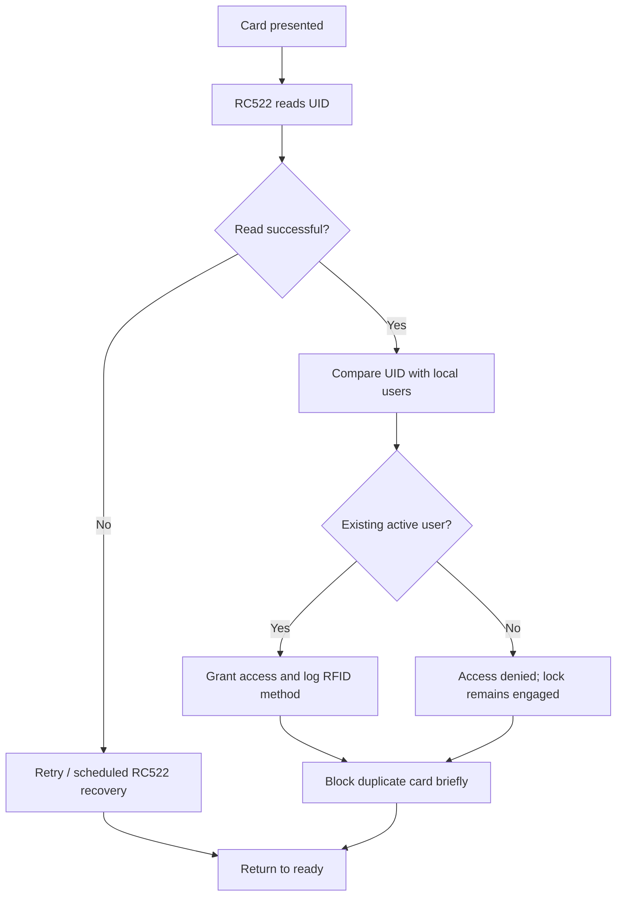
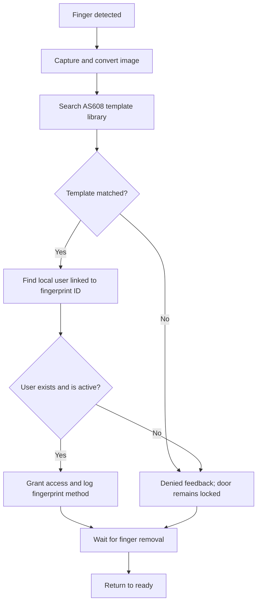
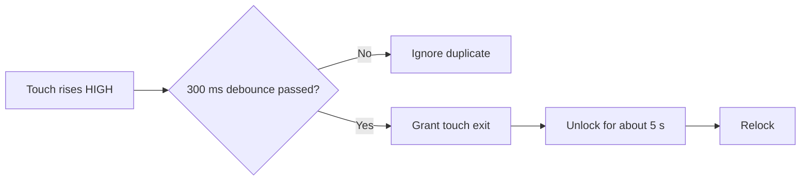
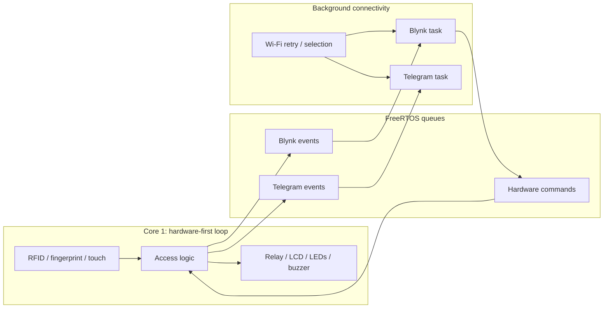
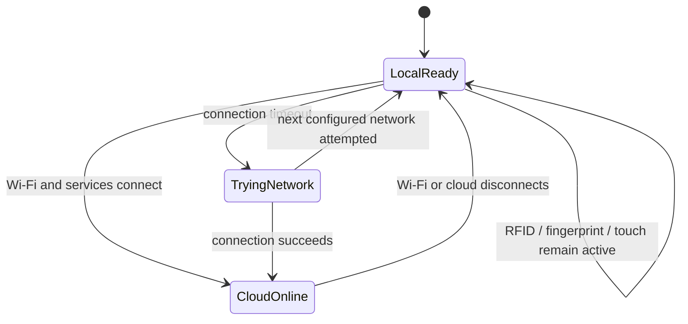
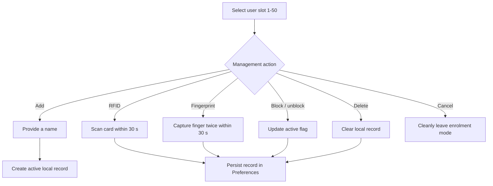
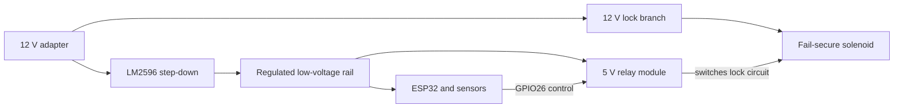
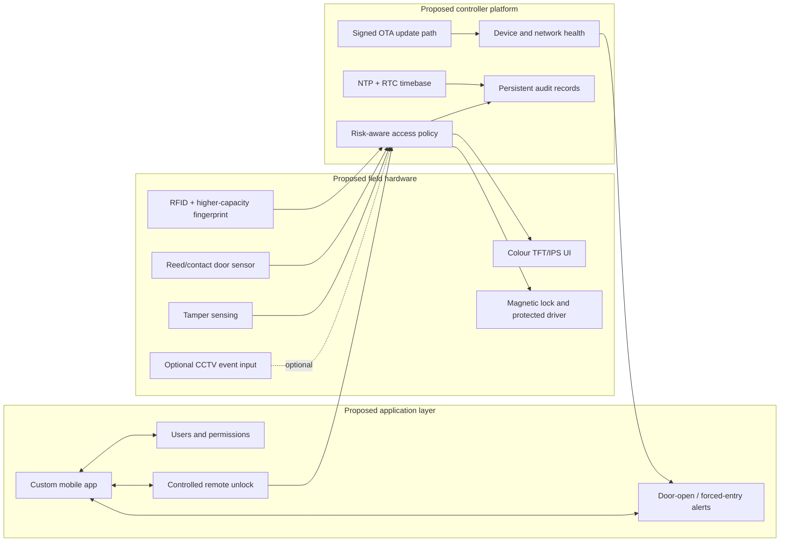

# PTA Smart Door

An integrated smart access-control prototype built around an ESP32 DevKit V1. It combines RFID, fingerprint authentication, touch-to-exit, local user records, physical status feedback, a relay-controlled fail-secure solenoid lock, and optional Blynk and Telegram services.

> **Scope:** product-oriented functional prototype for learning and academic demonstration. It is not a certified, production-ready security system.

## At a Glance

| Area | Implemented evidence |
| --- | --- |
| Controller | ESP32 DevKit V1 firmware in this repository |
| Entry methods | RC522 RFID and AS608 fingerprint |
| Exit method | TTP223 touch sensor |
| Lock actuation | 5 V active-low relay controlling a 12 V fail-secure solenoid lock |
| Local feedback | LCD1602 I2C, green/red LEDs, active buzzer |
| Local data | Up to 50 user slots stored with ESP32 Preferences |
| Connected services | Blynk control/status and Telegram monitoring |
| Resilience | Local authentication remains active without cloud connectivity; Wi-Fi, RFID and fingerprint recovery logic is present |
| Evidence | Public-safe firmware, Proteus RFID simulation, recorded UID test matrix and wiring diagram |

## Problem Statement

A conventional keyed prototype does not demonstrate electronic identity checking, event feedback or connected monitoring. This project explores how one microcontroller can coordinate multiple authentication methods and a physical lock while keeping essential local access available when Internet services are unavailable.

## Project Objectives

- Integrate RFID, fingerprint and touch-exit inputs on one ESP32.
- Keep authorised-user decisions local to the device.
- Drive clear LCD, LED and buzzer feedback for each access outcome.
- Unlock a fail-secure solenoid through a relay and relock automatically.
- Add optional monitoring and user-management functions through Blynk and Telegram.
- Recover from temporary network or reader faults without deliberately restarting the ESP32.
- Document the prototype so its architecture, constraints and evidence are reviewable.

## Implemented vs Planned

| Implemented in the published prototype | Proposed for Smart Door V2 |
| --- | --- |
| RFID and fingerprint authentication | Magnetic lock and revised lock-driver stage |
| TTP223 touch-to-exit | Reed/contact door-state sensing |
| Local ESP32 Preferences user records | Forced-entry and door-left-open detection |
| LCD1602, LEDs and buzzer feedback | Colour TFT/IPS interface |
| Five-second automatic relock | NTP plus RTC-backed timestamps |
| Blynk status, remote lock control and user actions | Custom mobile application and app permissions |
| Telegram status, user and recent-log queries | OTA updates and device-health monitoring |
| Wi-Fi retry/rotation and reader recovery logic | Tamper detection, smarter alerts and optional CCTV event linkage |
| Ten-entry in-memory access-log view | Persistent, exportable audit storage |

Everything in the right column is **future/proposed**, not part of the current build.

## Hardware Components

| Component | Role |
| --- | --- |
| ESP32 DevKit V1 | Main controller and network interface |
| RC522 | RFID card reader over SPI |
| AS608 | Fingerprint reader over UART2 at 57,600 baud |
| TTP223 | Touch-based exit request |
| LCD1602 I2C | Local prompts and status |
| 5 V active-low relay module | Electrical control interface for the lock circuit |
| 12 V fail-secure solenoid lock | Mechanical locking actuator |
| Green and red LEDs | Granted/denied status feedback |
| Active buzzer | Audible status feedback |
| LM2596 converter | Voltage step-down for the low-voltage electronics |
| 12 V adapter | Primary prototype supply |

## Overall System Architecture



The ESP32 makes the access decision locally. Blynk and Telegram extend management and visibility, but they are not required for RFID, fingerprint or touch-exit operation.

## How the Smart Door Works



### How to Use the Prototype

1. Confirm the lock mechanics, shared grounds and regulated supply connections before applying power.
2. Power the system. The firmware drives the relay LOW during start-up and loads saved users from ESP32 Preferences.
3. Wait for the ready display.
4. Present an enrolled RFID card or enrolled finger for entry, or touch the exit sensor from the protected side.
5. Observe the LCD, LEDs and buzzer. A granted request energises the unlock path for approximately five seconds; a denied request leaves the door locked.
6. If Blynk and Telegram have been configured privately, use them for status and management functions described below.

Do not use the prototype as the sole security control for a real occupied space.

## Authentication and Access Behaviour

### RFID Access Flow



### Fingerprint Access Flow



### Touch Exit Flow

The TTP223 input is edge-detected and debounced for 300 ms. A valid touch calls the same granted-access path with the identity `Exit User` and method `Touch`; it does not require RFID or fingerprint authentication because it represents an inside exit request.



### Authorised vs Denied Access

| Condition | Lock | Feedback | Record |
| --- | --- | --- | --- |
| Existing, active RFID user | Unlocks, then relocks | User/status on LCD; green LED and buzzer | Added to recent in-memory log and queued to connected services |
| Existing, active fingerprint user | Unlocks, then relocks | User/status on LCD; green LED and buzzer | Added to recent in-memory log and queued to connected services |
| Touch exit | Unlocks, then relocks | Exit/status feedback | Logged as `Exit User` / `Touch` |
| Unknown credential or blocked user | Remains locked | Denied LCD sequence, red LED and buzzer | Denied attempt enters recent log path |

### Automatic Relocking

The firmware sets `DOOR_UNLOCK_TIME` to 5,000 ms. `updateDoor()` checks the elapsed time without pausing the main control loop, then sets the active-low relay LOW, turns off the green LED, updates the door state and returns the LCD to ready.

## IoT and Background Services

The hardware loop runs separately from background network work. FreeRTOS queues carry hardware commands and status events between the local control logic and Blynk/Telegram tasks.



### Blynk Integration

The published firmware contains handlers for:

- manual unlock/lock commands;
- selecting a user slot and displaying its status;
- adding a user, enrolling RFID or fingerprint, blocking, unblocking and deleting;
- cancelling an active enrolment;
- choosing automatic or manual Wi-Fi network selection;
- displaying door state, access count, system status and recent logs.

Widget/datastream configuration in the Blynk console is not exported in this repository, so a reviewer should not assume the dashboard can be reproduced from firmware alone.

### Telegram Integration

The bot checks the configured chat ID before serving `/users`, `/logs` and `/status`. It also receives queued access and user-management notifications. The current firmware uses `telegramClient.setInsecure()`, which disables TLS certificate verification; this is a known security limitation for a prototype.

### Offline Operation and Reconnection



The main loop never depends on Blynk or Telegram to authorise a local credential. The background task rotates through configured Wi-Fi slots after a 10-second connection timeout and separately retries Blynk. Cloud notifications and remote commands are unavailable while disconnected.

## User Management



The local record contains a name, RFID UID, fingerprint template ID, active flag and existence flag. The ESP32 stores the record metadata in Preferences. Fingerprint biometric templates remain in the AS608 sensor; the firmware stores only the linked template ID.

## Access Logging

The current firmware holds the ten most recent formatted events in RAM and exposes them to Blynk/Telegram. This log is **not persistent across an ESP32 restart**, is not an independent audit trail and depends on network time for meaningful timestamps. User records, by contrast, are stored in Preferences.

## Verified ESP32 Pin Mapping

| Module | ESP32 connection |
| --- | --- |
| LCD1602 I2C | SDA GPIO21; SCL GPIO22; address `0x27` |
| RC522 RFID | SS/SDA GPIO5; RST GPIO2; SCK GPIO18; MOSI GPIO23; MISO GPIO19 |
| AS608 fingerprint | Sensor TX to ESP32 RX GPIO16; sensor RX to ESP32 TX GPIO17; `HardwareSerial(2)` at 57,600 baud |
| TTP223 touch exit | GPIO27 |
| Active-low relay | GPIO26 |
| Green LED | GPIO25 |
| Red LED | GPIO33 |
| Active buzzer | GPIO32 |

## Power Architecture



This diagram records the component-level power intent from the project hardware list. The repository does not contain a measured power budget or complete terminal-by-terminal power schematic. Before reproducing the build, verify LM2596 output voltage, relay contact rating, solenoid current, flyback suppression, conductor size, shared reference connections and safe isolation.

## Firmware Architecture

- **Hardware-first loop:** processes enrolment timeouts, queued commands, relock/buzzer/LCD timers, reader health, authentication and touch input.
- **Local persistence:** `Preferences` stores up to 50 user records.
- **State machines:** RFID, fingerprint initialisation, fingerprint processing and enrolment avoid long blocking sequences in normal operation.
- **Concurrency:** FreeRTOS queues and a mutex coordinate local state with Blynk and Telegram tasks.
- **Recovery:** scheduled RC522 reinitialisation and AS608 UART re-synchronisation occur without intentionally rebooting the ESP32.
- **Safe start state:** the relay is driven LOW and `doorUnlocked` is set false during setup.

## Reliability and Recovery Behaviour

Verified from the published firmware:

- A failed RC522 initialisation does not trap the controller in an infinite start-up loop; recovery is retried on a schedule.
- The AS608 receives a delayed start-up handshake, bounded retry logic and UART2 re-synchronisation without resetting the ESP32.
- Wi-Fi work runs in the background. Local access remains active during disconnection, and configured networks are retried/rotated.
- Blynk commands cross a queue into the hardware loop instead of directly manipulating hardware from the network callback.
- On boot/reset, the relay output is set to the locked state and saved user records are reloaded.

Not yet evidenced in the repository:

- controlled brownout or repeated power-interruption tests;
- measured recovery times across all fault types;
- long-duration soak testing;
- verification of the physical lock state for every power-supply failure mode.

## Engineering Challenges and Lessons Learned

These points come from recovery code and fix notes in the published firmware, not invented retrospective claims.

| Verified issue addressed | Engineering response | Practical lesson |
| --- | --- | --- |
| RC522 start-up, polling and intermittent reader state | Bounded reads, duplicate-card suppression, health checks and scheduled reinitialisation | Peripheral communication needs observable recovery paths, not only happy-path initialisation |
| AS608 could be contacted before its UART was ready | Delayed handshake, retry states and host-side UART2 re-sync | Sensors can have different power-up timing from the controller |
| Network operations could interfere with responsive local hardware | Hardware-first loop, background tasks and event queues | Cloud features should not sit in the critical local access path |
| Wi-Fi may be unavailable or move between configured networks | Timed connection attempts and multi-network rotation | Self-contained local behaviour improves resilience when infrastructure is unreliable |
| Enrolment actions can be abandoned or overlap | Mutually exclusive modes, 30-second timeout and explicit cancellation cleanup | Administrative workflows need failure and cancellation states |
| Shared user state is accessed from multiple tasks | Mutex-protected records and snapshots | Concurrency requires deliberate ownership of mutable state |

## Prototype Development Story

The repository evidence supports this progression:

1. **Concept:** electronically controlled door access with local identity checks.
2. **Initial prototype:** ESP32, relay/solenoid and local feedback components.
3. **Multi-method authentication:** RC522 RFID and AS608 fingerprint paths, plus touch exit.
4. **Hardware integration:** verified pin mapping, LCD/LED/buzzer feedback and wiring reference.
5. **IoT integration:** Blynk management/status and Telegram monitoring.
6. **Reliability improvements:** hardware-first processing, event queues, Wi-Fi retry and reader recovery states.
7. **Polished functional prototype:** public-safe firmware, Proteus demonstration material and reviewable documentation.
8. **Smart Door V2:** proposed sensing, UI, security and maintainability improvements—not implemented.

## Testing and Demonstration Evidence

| Evidence | What it supports | Boundary |
| --- | --- | --- |
| [Published firmware](firmware/FULL_CODE_SmartDoor_PTA1.ino) | Implemented control paths, timings, pin assignments, persistence and recovery logic | Source review does not prove every path was physically exercised |
| [Proteus project](docs/Litar%20simulasi%20Smart%20Door.pdsprj) | Reproducible RFID-oriented simulation artifact | Does not model the complete ESP32/AS608/cloud build |
| [Simulation guide](docs/PROTEUS_SIMULATION_GUIDE.md) | Repeatable demonstration procedure | Expected results should be recorded by each evaluator |
| [UID test matrix](docs/PROTEUS_UID_TESTS.md) | Two authorised and one unauthorised RFID cases | These are simulation cases, not security-performance measurements |
| [Wiring diagram](docs/Smart-Door-Cirkit-Designer-Wiring.png) | Component interconnection reference | Not a certified electrical drawing or measured as-built inspection |

See [Testing and Evidence](docs/TESTING_AND_EVIDENCE.md) for the verification matrix and unverified claims.


*Figure 1. Existing Cirkit Designer wiring reference. No personal photographs or private dashboard screenshots are included.*

## Security Considerations

- The public firmware contains placeholders, not real Wi-Fi, Blynk or Telegram credentials.
- Keep private credentials in a local-only configuration and review changes before every push.
- Telegram TLS certificate verification is disabled in the current firmware and should be corrected before any security-sensitive deployment.
- RFID UID matching alone is clonable and should not be treated as high-assurance authentication.
- Remote unlock increases risk: secure the Blynk/Telegram accounts, restrict bot chat IDs and revoke leaked tokens immediately.
- User names, credential identifiers and access events are sensitive operational data.
- The prototype lacks tamper sensing, door-position feedback and forced-entry detection.
- A fail-secure lock and its power arrangement must be assessed for fire, egress and local electrical requirements before real installation.

See [SECURITY.md](SECURITY.md) for repository hygiene and private configuration guidance.

## Current Limitations

- Academic prototype; no certification, threat assessment or compliance review.
- No door-position sensor, so software cannot confirm that the door physically closed.
- No forced-entry, door-left-open or enclosure-tamper detection.
- Access log is limited to ten RAM entries and is lost after restart.
- Cloud dashboard configuration is not exported for one-step reproduction.
- Network timestamps do not have an RTC-backed fallback.
- Telegram TLS verification is disabled.
- No documented power budget, battery/UPS protection or controlled power-failure test.
- Proteus evidence covers an RFID demonstration rather than the complete integrated physical system.
- No suitable public demo video or privacy-reviewed physical-prototype photographs are currently included.

## Smart Door V2 — Proposed Roadmap



| Current limitation | Proposed engineering improvement | Expected benefit |
| --- | --- | --- |
| Lock command is not confirmed by door position | Add reed/contact sensor | Detect door open/closed state and door-left-open events |
| No forced-entry signal | Compare contact state with authorised unlock state | Flag unexpected opening |
| Limited character LCD | Add colour TFT/IPS and structured local UI | Clearer prompts and maintenance status |
| Network-only accurate time | Add RTC backed by NTP synchronisation | More reliable event timestamps during outages |
| Volatile recent logs | Add bounded persistent/exportable audit storage | Better traceability across restarts |
| Dashboard-dependent administration | Build a custom authenticated app with roles/permissions | More controlled user management |
| No update mechanism | Add authenticated/signed OTA workflow with rollback | Maintainability without weakening firmware trust |
| No tamper awareness | Add enclosure and wiring tamper inputs | Earlier warning of physical interference |
| Single-method entry per event | Evaluate risk-based multi-factor authentication | Higher assurance for selected situations |

## Repository Structure

```text
PTA-Smart-Door/
├── README.md
├── SECURITY.md
├── firmware/
│   └── FULL_CODE_SmartDoor_PTA1.ino
└── docs/
    ├── Litar simulasi Smart Door.pdsprj
    ├── PROTEUS_SIMULATION_GUIDE.md
    ├── PROTEUS_UID_TESTS.md
    ├── Smart-Door-Cirkit-Designer-Wiring.png
    └── TESTING_AND_EVIDENCE.md
```

## Project Resources

- [Arduino firmware](firmware/FULL_CODE_SmartDoor_PTA1.ino) — public-safe credential placeholders.
- [Proteus simulation guide](docs/PROTEUS_SIMULATION_GUIDE.md)
- [RFID UID test cases](docs/PROTEUS_UID_TESTS.md)
- [Cirkit Designer project](https://app.cirkitdesigner.com/project/c76d481d-00aa-41fe-8f70-778ca7574145)

## Practical Learning Demonstrated

This project provides hands-on exposure to embedded I/O, SPI/I2C/UART peripherals, multi-method access logic, non-volatile records, state machines, FreeRTOS task coordination, IoT service integration, fault recovery, troubleshooting and engineering documentation. These are practical learning outcomes from a functional prototype, not claims of expert-level or production-security experience.
