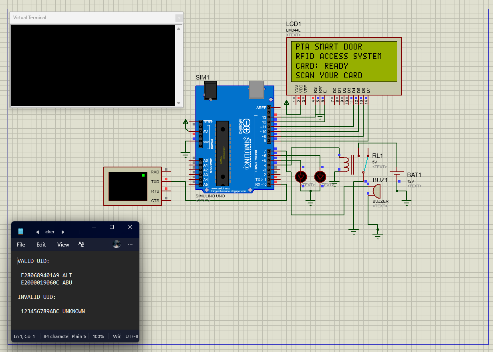
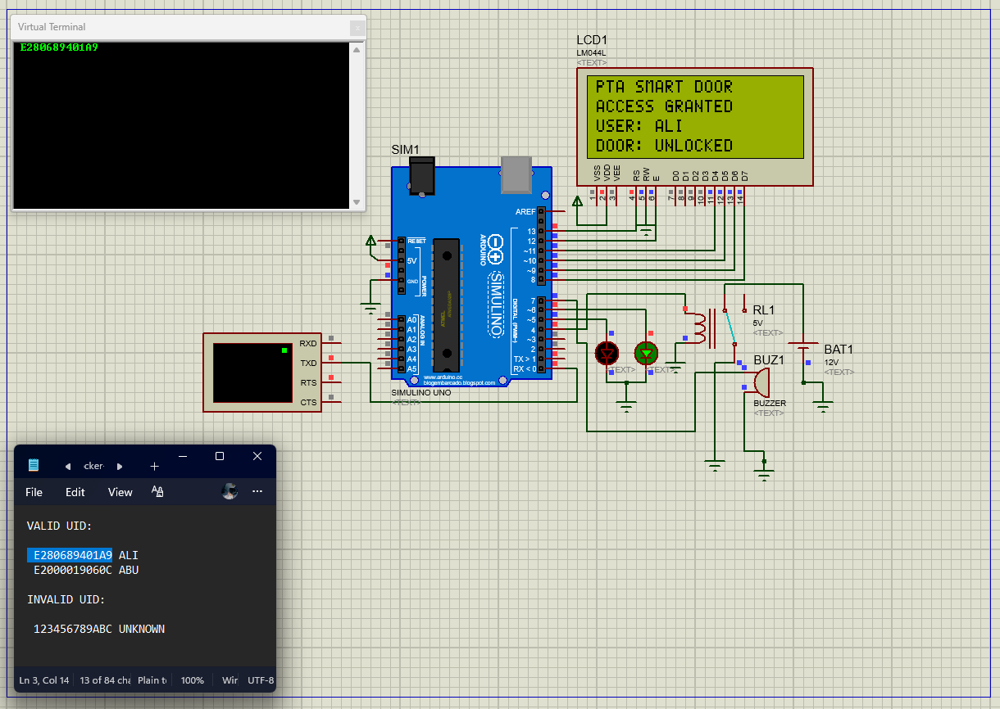

# Proteus Smart Door Simulation Guide

This guide explains how to download, run, and test the RFID access-control simulation. It is intended as a learning reference as well as a demonstration record.

## 1. Download and open the project

1. Open [Litar simulasi Smart Door.pdsprj](Litar%20simulasi%20Smart%20Door.pdsprj) in this repository.
2. Select **Raw** or **Download raw file**. If the file opens as text instead of downloading, save it with the original name and the .pdsprj extension.
3. Open the saved project in Proteus 8, then select the **Run** button (play icon).

> The simulation represents the RFID access flow using an Arduino UNO, virtual terminal, LCD, indicators, buzzer, and relay output.

## 2. Start at the ready state

When the simulation is running, the LCD shows that the card is ready to be scanned. The black window is the Virtual Terminal, where the RFID UID is entered.

*Figure 1. Initial state: the LCD is ready to receive an RFID card UID.*

## 3. Test an authorised UID

1. Open [PROTEUS_UID_TESTS.md](PROTEUS_UID_TESTS.md) or the UID note included with the project.
2. Copy only the UID, without the user name.
3. Click the Virtual Terminal, paste the UID, then press **Enter**.

Use E280689401A9 to test the recorded user **ALI**. The LCD confirms access and shows that the door is unlocked.

*Figure 2. Authorised UID result: access is granted for ALI and the door is unlocked.*

## 4. Test an unauthorised UID

Enter 123456789ABC and press **Enter**. This UID is not listed as authorised. The system does not unlock the door and returns to the ready screen.

*Figure 3. Unauthorised UID result: the LCD returns to the card-ready state.*

## UID test reference

| UID | Expected result |
| --- | --- |
| E280689401A9 | Access Granted; User: ALI; Door: Unlocked |
| E2000019060C | Access Granted; User: ABU; Door: Unlocked |
| 123456789ABC | Access denied; LCD returns to Card Ready / Scan Your Card |

## What the simulation demonstrates

The simulation follows a simple access-control sequence: receive UID from the Virtual Terminal, compare it with the authorised UID list, then either activate the access output or keep the door locked. LCD text, LEDs, buzzer, and relay state provide visible feedback for each outcome.

## Troubleshooting

- If the Virtual Terminal does not accept typing, click inside the black window first.
- Confirm the simulation is running before entering a UID.
- Press **Enter** after pasting the UID.
- Enter the UID only; do not include the user's name.
